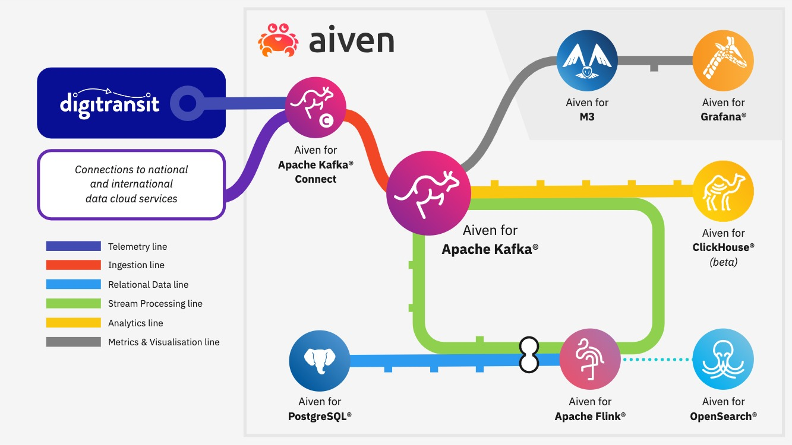

# Clickhouse-challenge


Welcome to the Aiven Clickhouse challenge!

With the launch of Aiven for Clickhouse We finally have the "C" for our KFC stack, the best combination of tools for realtime aleart and historic analytics.

The stack untilises Apache Kafka, Apache Flink, and Clickhouse to build up a robust, scleable architecture for getting the most from your data, whether it be batched ETL or realtime sensors.




## Instructions


For this challenge, We'll be using realtime data from [digitransit](https://digitransit.fi/en/developers/apis/4-realtime-api/) to plot maps and find new insights.

<<<<<<< HEAD
=======
Digitransit provides reatime bus informantion and positioning information for busses in Helsinki, We've saved out a few weeks worth of data as a CSV to experiemnt with:

[Here's the file! its over 4gb with over 15 million rows!](https://drive.google.com/file/d/1B4Scsuz4hTx2Hbd9seMIb0dDgbo-b0bf/view?usp=sharing)
>>>>>>> d514976 (Update README.md)

The goal is to find the best bus routes between the different KFC restaurants in Helsinki. To enter, create a trial account using one of these codes and use Aiven for clickhouse to process the data, Find the routs, plot them on a map and tag us / DM us on twitter with a screen shot of a map with these routes plotted on it.  

The prize for this is a limited edition Hat + The knowledge that you can indeed navigate public transport with the right SQL statement.

This notebook comes with a few starter queries and a mapping library to get you started. none of the queries here needed but they should help you get started.

## Setup

1. Create `env.sh` containing your Aiven API token

```
cat > env.sh <<EOF
export TF_VAR_aiven_api_token=<your api key>
EOF
```

2. Create infrastructure

> **Note:** Update `terraform.tfvars` with your Aiven project name first.

```
$ source env.sh
$ terraform init
$ terraform plan
$ terraform apply
```

3. Create Python 3 virtualenv and install dependencies

```
$ python3 -m venv venv
$ source venv/bin/activate
$ pip install -r requirements.txt
```

4. Load reference data into PostgreSQL (requires `psql` to be installed)

```
$ avn service cli bigdataldn-demo-postgres
defaultdb=> \i scripts/create_postgres_schema.sql; 
```

5. Update ClickHouse integration

```
$ avn project switch <your-project-name>
$ bash scripts/create_clickhouse_kafka_integration.sh
```

6. Create ClickHouse materialized view using SQL in `scripts/create_clickhouse_view.sql`

7. Prepare environment variables for Python Notebook
```
$ cd notebooks
$ bash env.sh
```
Start your prefererred Notebook environment


## Shortcuts

Incase you want to jump straight into the data, We've saved out a few weeks worth of data as a CSV to experiemnt with:

[Here's the file! its over 4gb with over 15 million rows!](https://drive.google.com/file/d/1B4Scsuz4hTx2Hbd9seMIb0dDgbo-b0bf/view?usp=sharing)


Please see the Aiven [docs](https://docs.aiven.io/docs/products/clickhouse/getting-started.html) for Clickhouse info on how to get step up and the main clickhouse [docs](https://clickhouse.com/docs/en/sql-reference) to for advanced SQL information 

For more help / questions ping us on twitter [@aiven_io](https://twitter.com/aiven_io), or me [@Bengamble7](https://twitter.com/BenGamble7) and we'll provide hints and even more terrible puns and clickhouse, or any of our 11 ~~secrect herbs and spices~~ products
